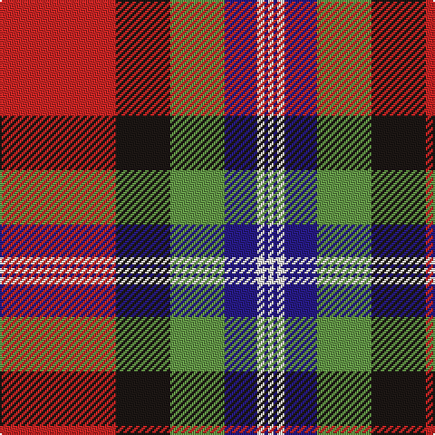

The parent of this is [Clyde Family (Hurleford) (Personal)](/tartans/r/64/k30/lg30/db18/w4/db2/w/3/)

This was sourced from register-of-tartans.  It is a [7 stripes tartan](/stripes/stripes7/).

Original link https://www.tartanregister.gov.uk/tartanDetails.aspx?ref=10532

## Thread count
R/64 K30 LG30 DB18 W4 DB2 W/3

## Palette
Each colour and its ΔE from the base-6 reference it is a variant of.

| Colour | Shade | Base | ΔE (OKLab) |
|---|---|---|---|
| DB |  `#271B86` | B  | 0.09 |
| K |  `#1C1714` | K  | 0.21 |
| LG |  `#649848` | G  | 0.19 |
| R |  `#CA2625` | R  | 0.03 |
| W |  `#F7F1E8` | W  | 0.01 |

# Sample pattern

ID: /variants/r/64/k30/lg30/db18/w4/db2/w/3-db271b86-k1c1714-lg649848-rca2625-wf7f1e8/
