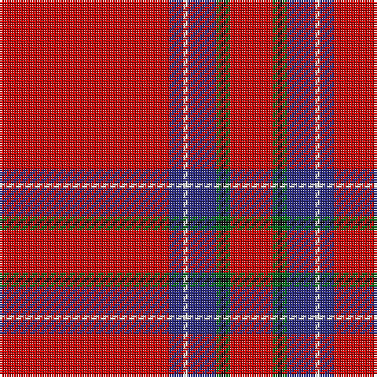

The parent of this is [Inverness District Tartan Tartan Number: 1438. Earliest known date: 1822 Made for Augustus, Earl of Inverness, sometime prior to 1822. Logan used this sett to illustrate his method of recording tartans in his book, 'The Scottish Gael..', published in 1831. The territorial designation of this Royal tartan makes it appropriate for use as a district tartan in the town and county of Inverness. The white stripe is sometimes rendered in yellow. See products available Copyright © Blair Urquhart, Comrie, 2015](/tartans/r/72/db6/ln2/db12/g2/k2/g2/r/18/)

This was sourced from house-of-tartan.  It is a [8 stripes tartan](/stripes/stripes8/).

Original link http://www.house-of-tartan.scotland.net/house/TartanViewjs.asp?colr=Def&tnam=1438

## Thread count
R/72 DB6 LN2 DB12 G2 K2 G2 R/18

## Palette
Each colour and its ΔE from the base-6 reference it is a variant of.

| Colour | Shade | Base | ΔE (OKLab) |
|---|---|---|---|
| DB |  `#2C2C80` | B  | 0.05 |
| G |  `#006818` | G  | 0.02 |
| K |  `#101010` | K  | 0.17 |
| LN |  `#E0E0E0` | W  | 0.06 |
| R |  `#C80000` | R  | 0.00 |

# Sample pattern

ID: /variants/r/72/db6/ln2/db12/g2/k2/g2/r/18-db2c2c80-g006818-k101010-lne0e0e0-rc80000/
