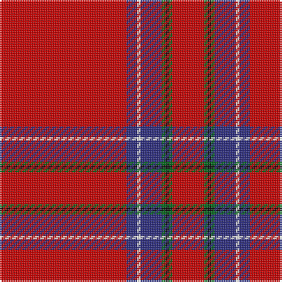

The parent of this is [Inverness - 1829 (District)](/tartans/r/72/db6/w2/db12/g2/k2/g2/r/18/)

This was sourced from tartans-authority.  It is a [8 stripes tartan](/stripes/stripes8/).

Original link http://www.tartansauthority.com/tartan-ferret/display/1438/

## Thread count
R/72 DB6 W2 DB12 G2 K2 G2 R/18

## Palette
Each colour and its ΔE from the base-6 reference it is a variant of.

| Colour | Shade | Base | ΔE (OKLab) |
|---|---|---|---|
| DB |  `#2C2C80` | B  | 0.05 |
| G |  `#006818` | G  | 0.02 |
| K |  `#101010` | K  | 0.17 |
| R |  `#C80000` | R  | 0.00 |
| W |  `#FCFCFC` | W  | 0.03 |

# Sample pattern

ID: /variants/r/72/db6/w2/db12/g2/k2/g2/r/18-db2c2c80-g006818-k101010-rc80000-wfcfcfc/
