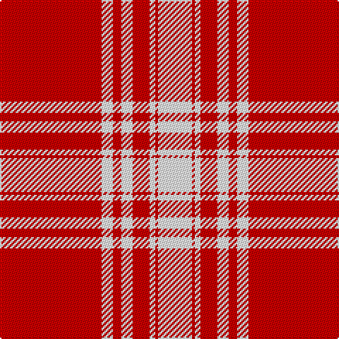

The parent of this is [Menzies 1815 - Cockburn](/tartans/r/72/w8/r6/w8/r12/w4/r2/w/24/)

This was sourced from tartans-authority.  It is a [8 stripes tartan](/stripes/stripes8/).

Original link http://www.tartansauthority.com/tartan-ferret/display/1699/

## Thread count
R/72 W8 R6 W8 R12 W4 R2 W/24

## Palette
Each colour and its ΔE from the base-6 reference it is a variant of.

| Colour | Shade | Base | ΔE (OKLab) |
|---|---|---|---|
| R |  `#C80000` | R  | 0.00 |
| W |  `#FCFCFC` | W  | 0.03 |

# Sample pattern

ID: /variants/r/72/w8/r6/w8/r12/w4/r2/w/24-rc80000-wfcfcfc/
