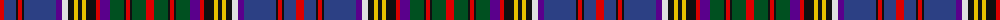

The parent of this is [Anderson (W L Anderson, Stirling)](/tartans/r/8/b12/k2/r4/k2/b32/p6/ln6/k6/y4/k4/y4/k10/r4/p10/g14/k2/r4/k2/g14/r/8/)

This was sourced from register-of-tartans.  It is a [21 stripes tartan](/stripes/stripes21/).

Original link https://www.tartanregister.gov.uk/tartanDetails.aspx?ref=76

## Thread count
R/8 B12 K2 R4 K2 B32 P6 LN6 K6 Y4 K4 Y4 K10 R4 P10 G14 K2 R4 K2 G14 R/8

## Palette
Each colour and its ΔE from the base-6 reference it is a variant of.

| Colour | Shade | Base | ΔE (OKLab) |
|---|---|---|---|
| B |  `#2C4084` | B  | 0.00 |
| G |  `#005020` | G  | 0.08 |
| K |  `#101010` | K  | 0.17 |
| LN |  `#E0E0E0` | W  | 0.06 |
| P |  `#5A008C` | B  | 0.12 |
| R |  `#DC0000` | R  | 0.04 |
| Y |  `#E8C000` | Y  | 0.00 |

ID: /variants/r/8/b12/k2/r4/k2/b32/p6/ln6/k6/y4/k4/y4/k10/r4/p10/g14/k2/r4/k2/g14/r/8-b2c4084-g005020-k101010-lne0e0e0-p5a008c-rdc0000-ye8c000/
