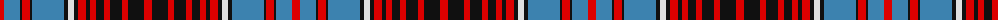

The parent of this is [Royal Canadian Air Force #3](/tartans/r/8/b16/k2/r8/k2/b32/k4/ln6/k4/r8/k4/r6/k8/r6/k12/r6/k16/r/8/)

This was sourced from register-of-tartans.  It is a [18 stripes tartan](/stripes/stripes18/).

Original link https://www.tartanregister.gov.uk/tartanDetails.aspx?ref=3593

## Thread count
R/8 B16 K2 R8 K2 B32 K4 LN6 K4 R8 K4 R6 K8 R6 K12 R6 K16 R/8

## Palette
Each colour and its ΔE from the base-6 reference it is a variant of.

| Colour | Shade | Base | ΔE (OKLab) |
|---|---|---|---|
| B |  `#3C82AF` | B  | 0.20 |
| K |  `#101010` | K  | 0.17 |
| LN |  `#E0E0E0` | W  | 0.06 |
| R |  `#DC0000` | R  | 0.04 |

ID: /variants/r/8/b16/k2/r8/k2/b32/k4/ln6/k4/r8/k4/r6/k8/r6/k12/r6/k16/r/8-b3c82af-k101010-lne0e0e0-rdc0000/
