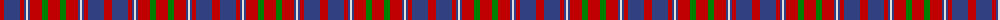

The parent of this is [Cameron of Lochiel](/tartans/r/8/b16/r4/b2/ln2/b2/r12/g6/r/12/)

This was sourced from weddslist.  It is a [9 stripes tartan](/stripes/stripes9/).

Original link http://www.weddslist.com/cgi-bin/tartans/pg.pl?source=sts

## Thread count
R/8 B16 R4 B2 LN2 B2 R12 G6 R/12

## Palette
Each colour and its ΔE from the base-6 reference it is a variant of.

| Colour | Shade | Base | ΔE (OKLab) |
|---|---|---|---|
| B |  `#304080` | B  | 0.01 |
| G |  `#008000` | G  | 0.09 |
| LN |  `#E0E0E0` | W  | 0.06 |
| R |  `#C00000` | R  | 0.02 |

ID: /variants/r/8/b16/r4/b2/ln2/b2/r12/g6/r/12-b304080-g008000-lne0e0e0-rc00000/
