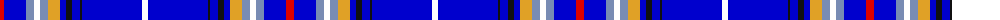

The parent of this is [Murison (2014)](/tartans/r/8/b22/ba8/w6/ba8/y12/b6/k6/b8/k2/b60/w/6/)

This was sourced from register-of-tartans.  It is a [12 stripes tartan](/stripes/stripes12/).

Original link https://www.tartanregister.gov.uk/tartanDetails.aspx?ref=11202

## Thread count
R/8 B22 Ba8 W6 Ba8 Y12 B6 K6 B8 K2 B60 W/6

## Palette
Each colour and its ΔE from the base-6 reference it is a variant of.

| Colour | Shade | Base | ΔE (OKLab) |
|---|---|---|---|
| B |  `#0000CD` | B  | 0.15 |
| Ba |  `#788CB4` | B  | 0.25 |
| K |  `#101010` | K  | 0.17 |
| R |  `#DC0000` | R  | 0.04 |
| W |  `#FFFFFF` | W  | 0.03 |
| Y |  `#E0A126` | Y  | 0.08 |

ID: /variants/r/8/b22/ba8/w6/ba8/y12/b6/k6/b8/k2/b60/w/6-b0000cd-ba788cb4-k101010-rdc0000-wffffff-ye0a126/
