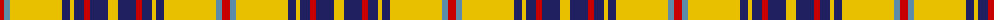

The parent of this is [Bracken](/tartans/r/8/b6/y52/dba8/y4/dba10/r6/dba18/y/10/)

This was sourced from register-of-tartans.  It is a [9 stripes tartan](/stripes/stripes9/).

Original link https://www.tartanregister.gov.uk/tartanDetails.aspx?ref=330

## Thread count
R/8 B6 Y52 DBa8 Y4 DBa10 R6 DBa18 Y/10

## Palette
Each colour and its ΔE from the base-6 reference it is a variant of.

| Colour | Shade | Base | ΔE (OKLab) |
|---|---|---|---|
| B |  `#5C8CA8` | B  | 0.23 |
| DB |  `#2C2C80` | B  | 0.05 |
| DBa |  `#202060` | B  | 0.11 |
| R |  `#C80000` | R  | 0.00 |
| Y |  `#E8C000` | Y  | 0.00 |

ID: /variants/r/8/b6/y52/dba8/y4/dba10/r6/dba18/y/10-b5c8ca8-db2c2c80-dba202060-rc80000-ye8c000/
