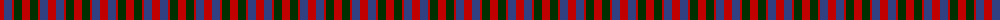
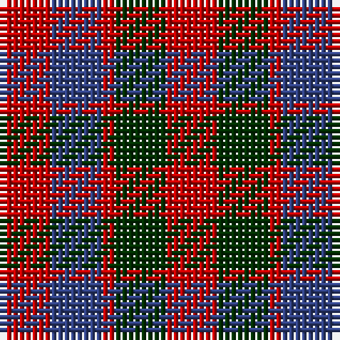

The parent of this is [Gow](/tartans/r/8/b8/r2/dg8/r/8/)

This was sourced from weddslist.  It is a [5 stripes tartan](/stripes/stripes5/).

Original link http://www.weddslist.com/cgi-bin/tartans/pg.pl?source=sts

## Thread count
R/8 B8 R2 DG8 R/8

## Palette
Each colour and its ΔE from the base-6 reference it is a variant of.

| Colour | Shade | Base | ΔE (OKLab) |
|---|---|---|---|
| B |  `#304080` | B  | 0.01 |
| DG |  `#003000` | G  | 0.18 |
| R |  `#C00000` | R  | 0.02 |

# Sample pattern

ID: /variants/r/8/b8/r2/dg8/r/8-b304080-dg003000-rc00000/
