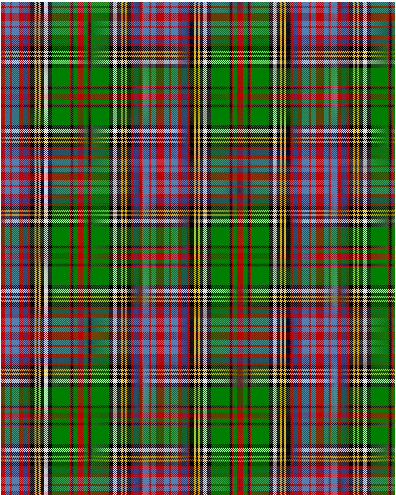

Anderson of Kinnedar, hunting

This was sourced from <no value>.  It is a 20 stripes tartan.

Original link http://www.weddslist.com/cgi-bin/tartans/pg.pl?source=sts

## Thread count
R/8 BA10 R4 BA14 R8 B10 R5 K9 Y4 K4 Y4 K7 LN8 K8 G36 R2 K4 R2 G8 R/6

## Palette
B#304080 BA#5480B0 G#008000 K#000000 LN#E0E0E0 R#C00000 Y#F0C000

# Sample pattern

ID: /variants/r/8/ba10/r4/ba14/r8/b10/r5/k9/y4/k4/y4/k7/ln8/k8/g36/r2/k4/r2/g8/r/6-b304080-ba5480b0-g008000-k000000-lne0e0e0-rc00000-yf0c000