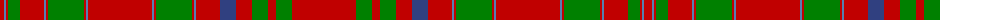

The parent of this is [MacAlister](/tartans/r/8/ba2/r2/g12/r24/ba2/r2/g36/r2/ba2/r64/ba2/r2/g36/r2/ba2/r24/b16/r16/g16/r8/g16/r/64/)

This was sourced from weddslist.  It is a [23 stripes tartan](/stripes/stripes23/).

Original link http://www.weddslist.com/cgi-bin/tartans/pg.pl?source=sts

## Thread count
R/8 Ba2 R2 G12 R24 Ba2 R2 G36 R2 Ba2 R64 Ba2 R2 G36 R2 Ba2 R24 B16 R16 G16 R8 G16 R/64

## Palette
Each colour and its ΔE from the base-6 reference it is a variant of.

| Colour | Shade | Base | ΔE (OKLab) |
|---|---|---|---|
| B |  `#304080` | B  | 0.01 |
| Ba |  `#5480B0` | B  | 0.20 |
| G |  `#008000` | G  | 0.09 |
| R |  `#C00000` | R  | 0.02 |

ID: /variants/r/8/ba2/r2/g12/r24/ba2/r2/g36/r2/ba2/r64/ba2/r2/g36/r2/ba2/r24/b16/r16/g16/r8/g16/r/64-b304080-ba5480b0-g008000-rc00000/
