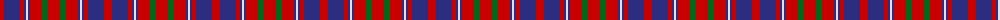

The parent of this is [Cameron of Lochiel (Smith) Clan Tartan Tartan Number: 1398. Earliest known date: 1764 According to I.B. Cameron Taylor from a portrait in Achnacarry of the Gentle Lochiel painted by George Chalmers in 1764. He wrote, "Of the unknown Cameron tartans in existence today, the Chief's personal tartan, the Cameron of Locheil, is undoubtably the oldest." See products available Copyright © Blair Urquhart, Comrie, 2015](/tartans/r/8/db16/r4/db2/ln2/db2/r12/g6/r/12/)

This was sourced from house-of-tartan.  It is a [9 stripes tartan](/stripes/stripes9/).

Original link http://www.house-of-tartan.scotland.net/house/TartanViewjs.asp?colr=Def&tnam=1398

## Thread count
R/8 DB16 R4 DB2 LN2 DB2 R12 G6 R/12

## Palette
Each colour and its ΔE from the base-6 reference it is a variant of.

| Colour | Shade | Base | ΔE (OKLab) |
|---|---|---|---|
| DB |  `#2C2C80` | B  | 0.05 |
| G |  `#006818` | G  | 0.02 |
| LN |  `#E0E0E0` | W  | 0.06 |
| R |  `#C80000` | R  | 0.00 |

ID: /variants/r/8/db16/r4/db2/ln2/db2/r12/g6/r/12-db2c2c80-g006818-lne0e0e0-rc80000/
