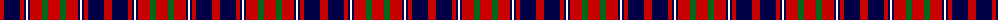

The parent of this is [Cameron of Lochiel -1820 (Clan)](/tartans/r/8/db16/r4/db2/w2/db2/r12/g6/r/12/)

This was sourced from tartans-authority.  It is a [9 stripes tartan](/stripes/stripes9/).

Original link http://www.tartansauthority.com/tartan-ferret/display/1398/

## Thread count
R/8 DB16 R4 DB2 W2 DB2 R12 G6 R/12

## Palette
Each colour and its ΔE from the base-6 reference it is a variant of.

| Colour | Shade | Base | ΔE (OKLab) |
|---|---|---|---|
| DB |  `#000048` | B  | 0.21 |
| G |  `#006818` | G  | 0.02 |
| R |  `#C80000` | R  | 0.00 |
| W |  `#FCFCFC` | W  | 0.03 |

ID: /variants/r/8/db16/r4/db2/w2/db2/r12/g6/r/12-db000048-g006818-rc80000-wfcfcfc/
