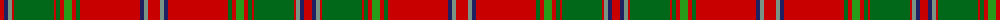

The parent of this is [All Ireland Red (Fashion)](/tartans/r/8/db4/lg4/r2/ga40/r2/ga4/r4/g8/r4/ga4/r60/db4/lg4/r/12/)

This was sourced from tartans-authority.  It is a [15 stripes tartan](/stripes/stripes15/).

Original link http://www.tartansauthority.com/tartan-ferret/display/4067/

## Thread count
R/8 DB4 LG4 R2 Ga40 R2 Ga4 R4 G8 R4 Ga4 R60 DB4 LG4 R/12

## Palette
Each colour and its ΔE from the base-6 reference it is a variant of.

| Colour | Shade | Base | ΔE (OKLab) |
|---|---|---|---|
| DB |  `#202060` | B  | 0.11 |
| G |  `#289C18` | G  | 0.18 |
| Ga |  `#006818` | G  | 0.02 |
| LG |  `#789484` | G  | 0.23 |
| R |  `#C80000` | R  | 0.00 |

ID: /variants/r/8/db4/lg4/r2/ga40/r2/ga4/r4/g8/r4/ga4/r60/db4/lg4/r/12-db202060-g289c18-ga006818-lg789484-rc80000/
