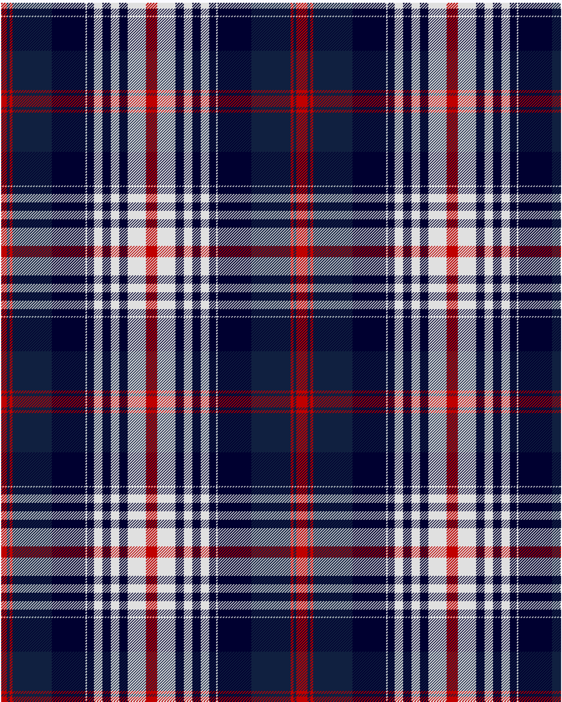

Hogmany Plaid

This was sourced from <no value>.  It is a 13 stripes tartan.

Original link http://www.weddslist.com/cgi-bin/tartans/pg.pl?source=sts

## Thread count
R/8 DB4 R4 DB56 DBA48 LN2 DBA10 LN12 DBA12 LN12 DBA12 LN26 R/8

## Palette
DB#102040 DBA#000030 LN#E0E0E0 R#C00000

# Sample pattern

ID: /variants/r/8/db4/r4/db56/dba48/ln2/dba10/ln12/dba12/ln12/dba12/ln26/r/8-db102040-dba000030-lne0e0e0-rc00000