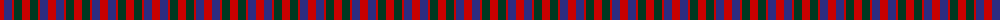
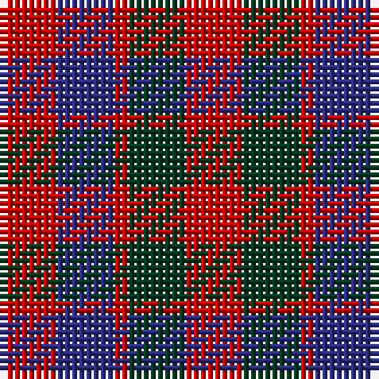

The parent of this is [Gow Clan Tartan Tartan Number: 1390. Earliest known date: c.1815 This tartan can be seen in a portrait of Neil Gow, by Sir Henry Raeburn. Possibly the basis for the design of later tartans. The Gows or MacGowans were associated with the MacDonalds and the Clan Chattan. Gow is Gaelic for Smith meaning blacksmith. See products available Copyright © Blair Urquhart, Comrie, 2015](/tartans/r/8/db8/r2/dg8/r/8/)

This was sourced from house-of-tartan.  It is a [5 stripes tartan](/stripes/stripes5/).

Original link http://www.house-of-tartan.scotland.net/house/TartanViewjs.asp?colr=Def&tnam=1390

## Thread count
R/8 DB8 R2 DG8 R/8

## Palette
Each colour and its ΔE from the base-6 reference it is a variant of.

| Colour | Shade | Base | ΔE (OKLab) |
|---|---|---|---|
| DB |  `#2C2C80` | B  | 0.05 |
| DG |  `#003820` | G  | 0.16 |
| R |  `#C80000` | R  | 0.00 |

# Sample pattern

ID: /variants/r/8/db8/r2/dg8/r/8-db2c2c80-dg003820-rc80000/
