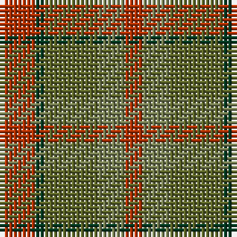

The parent of this is [Belladrum Estate](/tartans/r/8/dg2/g12/ga6/r/4/)

This was sourced from register-of-tartans.  It is a [5 stripes tartan](/stripes/stripes5/).

Original link https://www.tartanregister.gov.uk/tartanDetails.aspx?ref=11573

## Thread count
R/8 DG2 G12 Ga6 R/4

## Palette
Each colour and its ΔE from the base-6 reference it is a variant of.

| Colour | Shade | Base | ΔE (OKLab) |
|---|---|---|---|
| DG |  `#003820` | G  | 0.16 |
| G |  `#5C6428` | G  | 0.09 |
| Ga |  `#767E52` | G  | 0.17 |
| R |  `#B03000` | R  | 0.05 |

# Sample pattern

ID: /variants/r/8/dg2/g12/ga6/r/4-dg003820-g5c6428-ga767e52-rb03000/
