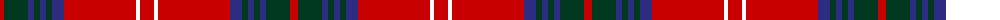

The parent of this is [Chisholm of Strathglass](/tartans/r/8/dg24/db6/dg6/db6/dg6/db12/r72/w4/r/14/)

This was sourced from register-of-tartans.  It is a [10 stripes tartan](/stripes/stripes10/).

Original link https://www.tartanregister.gov.uk/tartanDetails.aspx?ref=642

## Thread count
R/8 DG24 DB6 DG6 DB6 DG6 DB12 R72 W4 R/14

## Palette
Each colour and its ΔE from the base-6 reference it is a variant of.

| Colour | Shade | Base | ΔE (OKLab) |
|---|---|---|---|
| DB |  `#2C2C80` | B  | 0.05 |
| DG |  `#003820` | G  | 0.16 |
| K |  `#101010` | K  | 0.17 |
| R |  `#C80000` | R  | 0.00 |
| W |  `#FCFCFC` | W  | 0.03 |

ID: /variants/r/8/dg24/db6/dg6/db6/dg6/db12/r72/w4/r/14-db2c2c80-dg003820-k101010-rc80000-wfcfcfc/
