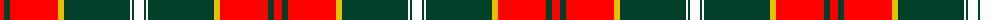

The parent of this is [Sutherland de Albergaria Dress (Personal)](/tartans/r/8/dg6/r48/y6/dg66/w2/dg2/w/10/)

This was sourced from register-of-tartans.  It is a [8 stripes tartan](/stripes/stripes8/).

Original link https://www.tartanregister.gov.uk/tartanDetails.aspx?ref=11621

## Thread count
R/8 DG6 R48 Y6 DG66 W2 DG2 W/10

## Palette
Each colour and its ΔE from the base-6 reference it is a variant of.

| Colour | Shade | Base | ΔE (OKLab) |
|---|---|---|---|
| DG |  `#004028` | G  | 0.14 |
| R |  `#FF0000` | R  | 0.11 |
| W |  `#FFFFFF` | W  | 0.03 |
| Y |  `#E8C000` | Y  | 0.00 |

# Sample pattern

ID: /variants/r/8/dg6/r48/y6/dg66/w2/dg2/w/10-dg004028-rff0000-wffffff-ye8c000/
