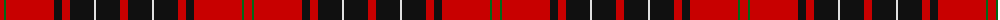

The parent of this is [Wemyss Clan Tartan Tartan Number: 1512. Earliest known date: 1842 Wemyss means cave and probably originates from the caves beneath MacDuff castle. There is a long and interesting article on the family of Wemyss in William Anderson's 'The Scottish Nation' published by A Fullarton in 1874. See products available Copyright © Blair Urquhart, Comrie, 2015](/tartans/r/8/g2/r48/k8/r8/k24/ln2/k24/r/8/)

This was sourced from house-of-tartan.  It is a [9 stripes tartan](/stripes/stripes9/).

Original link http://www.house-of-tartan.scotland.net/house/TartanViewjs.asp?colr=Def&tnam=1512

## Thread count
R/8 G2 R48 K8 R8 K24 LN2 K24 R/8

## Palette
Each colour and its ΔE from the base-6 reference it is a variant of.

| Colour | Shade | Base | ΔE (OKLab) |
|---|---|---|---|
| G |  `#006818` | G  | 0.02 |
| K |  `#101010` | K  | 0.17 |
| LN |  `#E0E0E0` | W  | 0.06 |
| R |  `#C80000` | R  | 0.00 |

ID: /variants/r/8/g2/r48/k8/r8/k24/ln2/k24/r/8-g006818-k101010-lne0e0e0-rc80000/
