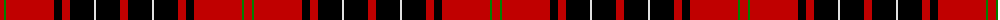

The parent of this is [Wemyss](/tartans/r/8/g2/r48/k8/r8/k24/ln2/k24/r/8/)

This was sourced from weddslist.  It is a [9 stripes tartan](/stripes/stripes9/).

Original link http://www.weddslist.com/cgi-bin/tartans/pg.pl?source=sts

## Thread count
R/8 G2 R48 K8 R8 K24 LN2 K24 R/8

## Palette
Each colour and its ΔE from the base-6 reference it is a variant of.

| Colour | Shade | Base | ΔE (OKLab) |
|---|---|---|---|
| G |  `#008000` | G  | 0.09 |
| K |  `#000000` | K  | 0.00 |
| LN |  `#E0E0E0` | W  | 0.06 |
| R |  `#C00000` | R  | 0.02 |

ID: /variants/r/8/g2/r48/k8/r8/k24/ln2/k24/r/8-g008000-k000000-lne0e0e0-rc00000/
