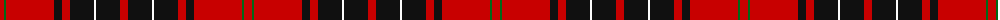

The parent of this is [Wemyss (Clan)](/tartans/r/8/g2/r48/k8/r8/k24/w2/k24/r/8/)

This was sourced from tartans-authority.  It is a [9 stripes tartan](/stripes/stripes9/).

Original link http://www.tartansauthority.com/tartan-ferret/display/1512/

## Thread count
R/8 G2 R48 K8 R8 K24 W2 K24 R/8

## Palette
Each colour and its ΔE from the base-6 reference it is a variant of.

| Colour | Shade | Base | ΔE (OKLab) |
|---|---|---|---|
| G |  `#006818` | G  | 0.02 |
| K |  `#101010` | K  | 0.17 |
| R |  `#C80000` | R  | 0.00 |
| W |  `#FCFCFC` | W  | 0.03 |

ID: /variants/r/8/g2/r48/k8/r8/k24/w2/k24/r/8-g006818-k101010-rc80000-wfcfcfc/
