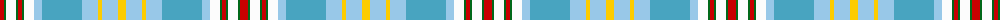

The parent of this is [Pille Family (Personal)](/tartans/r/8/g2/w10/g2/r4/g2/w10/lb8/b40/lb16/y4/lb16/y/8/)

This was sourced from tartans-authority.  It is a [13 stripes tartan](/stripes/stripes13/).

Original link http://www.tartansauthority.com/tartan-ferret/display/10345/

## Thread count
R/8 G2 W10 G2 R4 G2 W10 LB8 B40 LB16 Y4 LB16 Y/8

## Palette
Each colour and its ΔE from the base-6 reference it is a variant of.

| Colour | Shade | Base | ΔE (OKLab) |
|---|---|---|---|
| B |  `#48A4C0` | Y  | 0.28 |
| G |  `#006818` | G  | 0.02 |
| LB |  `#98C8E8` | W  | 0.17 |
| R |  `#C80000` | R  | 0.00 |
| W |  `#FCFCFC` | W  | 0.03 |
| Y |  `#FCCC00` | Y  | 0.04 |

ID: /variants/r/8/g2/w10/g2/r4/g2/w10/lb8/b40/lb16/y4/lb16/y/8-b48a4c0-g006818-lb98c8e8-rc80000-wfcfcfc-yfccc00/
