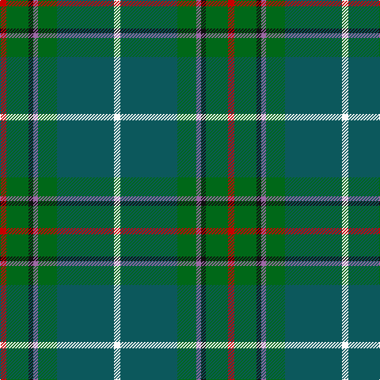

The parent of this is [Vipont (White line)](/tartans/r/8/ga28/k6/lp6/ga24/g72/w/8/)

This was sourced from register-of-tartans.  It is a [7 stripes tartan](/stripes/stripes7/).

Original link https://www.tartanregister.gov.uk/tartanDetails.aspx?ref=4463

## Thread count
R/8 Ga28 K6 LP6 Ga24 G72 W/8

## Palette
Each colour and its ΔE from the base-6 reference it is a variant of.

| Colour | Shade | Base | ΔE (OKLab) |
|---|---|---|---|
| G |  `#0C585C` | B  | 0.11 |
| Ga |  `#006818` | G  | 0.02 |
| K |  `#101010` | K  | 0.17 |
| LP |  `#9C68A4` | R  | 0.21 |
| P |  `#9058D8` | B  | 0.22 |
| R |  `#C80000` | R  | 0.00 |
| W |  `#FCFCFC` | W  | 0.03 |

# Sample pattern

ID: /variants/r/8/ga28/k6/lp6/ga24/g72/w/8-g0c585c-ga006818-k101010-lp9c68a4-p9058d8-rc80000-wfcfcfc/
