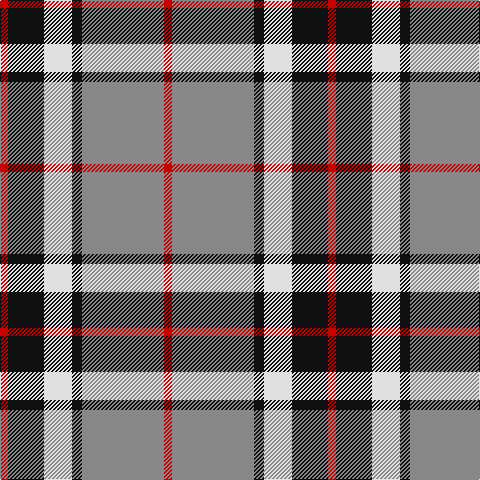

The parent of this is [Downside (Corporate)](/tartans/r/8/k36/ln28/k10/n82/r/8/)

This was sourced from tartans-authority.  It is a [6 stripes tartan](/stripes/stripes6/).

Original link http://www.tartansauthority.com/tartan-ferret/display/8063/

## Thread count
R/8 K36 LN28 K10 N82 R/8

## Palette
Each colour and its ΔE from the base-6 reference it is a variant of.

| Colour | Shade | Base | ΔE (OKLab) |
|---|---|---|---|
| K |  `#101010` | K  | 0.17 |
| LN |  `#E0E0E0` | W  | 0.06 |
| N |  `#888888` | R  | 0.24 |
| R |  `#C80000` | R  | 0.00 |

# Sample pattern

ID: /variants/r/8/k36/ln28/k10/n82/r/8-k101010-lne0e0e0-n888888-rc80000/
