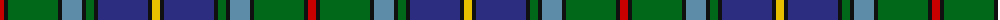

The parent of this is [Ayrton Family Tartan Tartan Number: 1584. Earliest known date: pre 2003 Amended version See products available Copyright © Blair Urquhart, Comrie, 2015](/tartans/r/8/k4/g50/k4/b20/k4/g8/k4/db50/k4/y/8/)

This was sourced from house-of-tartan.  It is a [11 stripes tartan](/stripes/stripes11/).

Original link http://www.house-of-tartan.scotland.net/house/TartanViewjs.asp?colr=Def&tnam=1584

## Thread count
R/8 K4 G50 K4 B20 K4 G8 K4 DB50 K4 Y/8

## Palette
Each colour and its ΔE from the base-6 reference it is a variant of.

| Colour | Shade | Base | ΔE (OKLab) |
|---|---|---|---|
| B |  `#5C8CA8` | B  | 0.23 |
| DB |  `#2C2C80` | B  | 0.05 |
| G |  `#006818` | G  | 0.02 |
| K |  `#101010` | K  | 0.17 |
| R |  `#C80000` | R  | 0.00 |
| Y |  `#E8C000` | Y  | 0.00 |

ID: /variants/r/8/k4/g50/k4/b20/k4/g8/k4/db50/k4/y/8-b5c8ca8-db2c2c80-g006818-k101010-rc80000-ye8c000/
