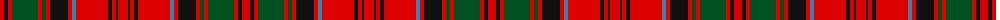

The parent of this is [Unidentified No 3 #2](/tartans/r/8/k4/r4/g26/r4/g4/r4/k18/r4/b4/r32/k4/r4/k2/r/10/)

This was sourced from register-of-tartans.  It is a [15 stripes tartan](/stripes/stripes15/).

Original link https://www.tartanregister.gov.uk/tartanDetails.aspx?ref=4321

## Thread count
R/8 K4 R4 G26 R4 G4 R4 K18 R4 B4 R32 K4 R4 K2 R/10

## Palette
Each colour and its ΔE from the base-6 reference it is a variant of.

| Colour | Shade | Base | ΔE (OKLab) |
|---|---|---|---|
| B |  `#3C82AF` | B  | 0.20 |
| G |  `#005020` | G  | 0.08 |
| K |  `#101010` | K  | 0.17 |
| R |  `#DC0000` | R  | 0.04 |

ID: /variants/r/8/k4/r4/g26/r4/g4/r4/k18/r4/b4/r32/k4/r4/k2/r/10-b3c82af-g005020-k101010-rdc0000/
