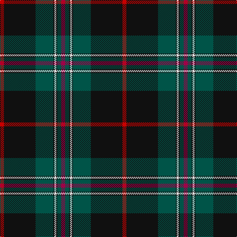

The parent of this is [Hot Boontjie](/tartans/r/8/k64/g36/k2/ln4/k2/g8/ra/8/)

This was sourced from register-of-tartans.  It is a [8 stripes tartan](/stripes/stripes8/).

Original link https://www.tartanregister.gov.uk/tartanDetails.aspx?ref=11317

## Thread count
R/8 K64 G36 K2 LN4 K2 G8 Ra/8

## Palette
Each colour and its ΔE from the base-6 reference it is a variant of.

| Colour | Shade | Base | ΔE (OKLab) |
|---|---|---|---|
| G |  `#005448` | G  | 0.11 |
| K |  `#101010` | K  | 0.17 |
| LN |  `#E0E0E0` | W  | 0.06 |
| R |  `#C80000` | R  | 0.00 |
| Ra |  `#A00048` | R  | 0.11 |

# Sample pattern

ID: /variants/r/8/k64/g36/k2/ln4/k2/g8/ra/8-g005448-k101010-lne0e0e0-rc80000-raa00048/
