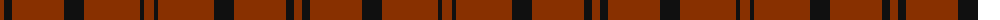

The parent of this is [Dunbar, John Telfer (Personal)](/tartans/r/8/k8/r52/k20/r56/k4/r/10/)

This was sourced from tartans-authority.  It is a [7 stripes tartan](/stripes/stripes7/).

Original link http://www.tartansauthority.com/tartan-ferret/display/4745/

## Thread count
R/8 K8 R52 K20 R56 K4 R/10

## Palette
Each colour and its ΔE from the base-6 reference it is a variant of.

| Colour | Shade | Base | ΔE (OKLab) |
|---|---|---|---|
| K |  `#101010` | K  | 0.17 |
| R |  `#883000` | R  | 0.13 |

# Sample pattern

ID: /variants/r/8/k8/r52/k20/r56/k4/r/10-k101010-r883000/
