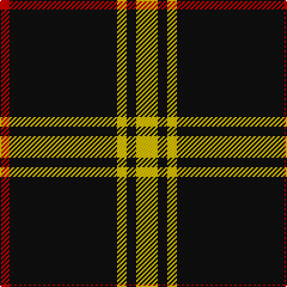

The parent of this is [Gwynn Name Tartan Tartan Number: 5745. Earliest known date: 2001, June Designed in 2003 by Paul Gwynn of Texas. A Gwynn family tartan based on the Welsh national and incorporating Gwynn family colours. Can be worn by all of the name Gwynn. See also Gwyn (Welsh). See products available Copyright © Blair Urquhart, Comrie, 2015](/tartans/r/8/k90/y8/k8/y/18/)

This was sourced from house-of-tartan.  It is a [5 stripes tartan](/stripes/stripes5/).

Original link http://www.house-of-tartan.scotland.net/house/TartanViewjs.asp?colr=Def&tnam=5745

## Thread count
R/8 K90 Y8 K8 Y/18

## Palette
Each colour and its ΔE from the base-6 reference it is a variant of.

| Colour | Shade | Base | ΔE (OKLab) |
|---|---|---|---|
| K |  `#101010` | K  | 0.17 |
| R |  `#C80000` | R  | 0.00 |
| Y |  `#E8C000` | Y  | 0.00 |

# Sample pattern

ID: /variants/r/8/k90/y8/k8/y/18-k101010-rc80000-ye8c000/
