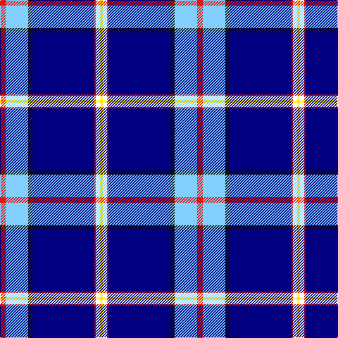

The parent of this is [Dress Blue Fashion Tartan Tartan Number: 10689. Earliest known date: 5 September 2012 This tartan is intended as an unofficial complementary alternative to the existing tartans worn by US Marines. The design should be recognisable to anyone who is familiar with the Dress Blue uniform. It may be worn by anyone who has served in the US Marine Corps, who has a family member who is, or was, a Marine, or who wishes to honour those who are, or have served as, Marines. The colours are presented in the tartan in the same ratios as they would appear in the uniform. The dark blue is from the uniform blouse, the light blue is from the trousers, the red is from the piping on the blouse and the 'blood stripe' down the trouser legs, the white is from the cover, waistbelt and gloves, the gold is from the brass buttons, waistplate and EGA, and the black is from the cover bill and the shoes. See products available Copyright © Blair Urquhart, Comrie, 2015](/tartans/r/8/lb32/k6/db88/r2/w6/y/4/)

This was sourced from house-of-tartan.  It is a [7 stripes tartan](/stripes/stripes7/).

Original link http://www.house-of-tartan.scotland.net/house/TartanViewjs.asp?colr=Def&tnam=10689

## Thread count
R/8 LB32 K6 DB88 R2 W6 Y/4

## Palette
Each colour and its ΔE from the base-6 reference it is a variant of.

| Colour | Shade | Base | ΔE (OKLab) |
|---|---|---|---|
| DB |  `#000080` | B  | 0.14 |
| K |  `#101010` | K  | 0.17 |
| LB |  `#82CFFD` | W  | 0.18 |
| R |  `#E3170D` | R  | 0.06 |
| W |  `#FFFFFF` | W  | 0.03 |
| Y |  `#FFE700` | Y  | 0.11 |

# Sample pattern

ID: /variants/r/8/lb32/k6/db88/r2/w6/y/4-db000080-k101010-lb82cffd-re3170d-wffffff-yffe700/
