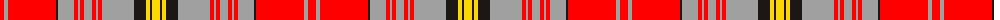

The parent of this is [Internationale, The](/tartans/r/8/n4/r48/k2/n16/r4/n2/r4/n8/r4/n2/r4/n32/k12/y4/k2/y/8/)

This was sourced from register-of-tartans.  It is a [17 stripes tartan](/stripes/stripes17/).

Original link https://www.tartanregister.gov.uk/tartanDetails.aspx?ref=11376

## Thread count
R/8 N4 R48 K2 N16 R4 N2 R4 N8 R4 N2 R4 N32 K12 Y4 K2 Y/8

## Palette
Each colour and its ΔE from the base-6 reference it is a variant of.

| Colour | Shade | Base | ΔE (OKLab) |
|---|---|---|---|
| K |  `#1C1714` | K  | 0.21 |
| N |  `#A0A0A0` | Y  | 0.20 |
| R |  `#FF0000` | R  | 0.11 |
| Y |  `#FFD700` | Y  | 0.07 |

ID: /variants/r/8/n4/r48/k2/n16/r4/n2/r4/n8/r4/n2/r4/n32/k12/y4/k2/y/8-k1c1714-na0a0a0-rff0000-yffd700/
