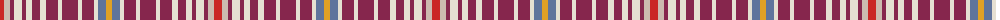

The parent of this is [Bradwell, Amy Name Tartan Tartan Number: 10735. Earliest known date: 12 November 2012 Designed to celebrate Amy Bradwell's 30th birthday and the relocation of the family to Scotland in 2012. The colours reflect Amy's personal preferences and the family's mixed Yorkshire and Scottish heritage. See products available Copyright © Blair Urquhart, Comrie, 2015](/tartans/r/8/n6/dr4/w8/dr4/w6/dr8/w6/dr12/w4/dr16/w4/dr12/w4/b8/y/6/)

This was sourced from house-of-tartan.  It is a [16 stripes tartan](/stripes/stripes16/).

Original link http://www.house-of-tartan.scotland.net/house/TartanViewjs.asp?colr=Def&tnam=10735

## Thread count
R/8 N6 DR4 W8 DR4 W6 DR8 W6 DR12 W4 DR16 W4 DR12 W4 B8 Y/6

## Palette
Each colour and its ΔE from the base-6 reference it is a variant of.

| Colour | Shade | Base | ΔE (OKLab) |
|---|---|---|---|
| B |  `#5F749C` | B  | 0.17 |
| DR |  `#86264D` | R  | 0.15 |
| N |  `#CCBAAF` | Y  | 0.15 |
| R |  `#CA2625` | R  | 0.03 |
| W |  `#E5E0D2` | W  | 0.06 |
| Y |  `#E0A126` | Y  | 0.08 |

ID: /variants/r/8/n6/dr4/w8/dr4/w6/dr8/w6/dr12/w4/dr16/w4/dr12/w4/b8/y/6-b5f749c-dr86264d-nccbaaf-rca2625-we5e0d2-ye0a126/
