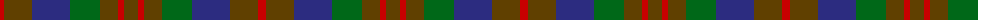

The parent of this is [Dorward/Dogwood (Name)](/tartans/r/8/t28/db38/g30/t18/r6/t/14/)

This was sourced from tartans-authority.  It is a [7 stripes tartan](/stripes/stripes7/).

Original link http://www.tartansauthority.com/tartan-ferret/display/2533/

## Thread count
R/8 T28 DB38 G30 T18 R6 T/14

## Palette
Each colour and its ΔE from the base-6 reference it is a variant of.

| Colour | Shade | Base | ΔE (OKLab) |
|---|---|---|---|
| DB |  `#2C2C80` | B  | 0.05 |
| G |  `#006818` | G  | 0.02 |
| R |  `#C80000` | R  | 0.00 |
| T |  `#604000` | G  | 0.14 |

# Sample pattern

ID: /variants/r/8/t28/db38/g30/t18/r6/t/14-db2c2c80-g006818-rc80000-t604000/
