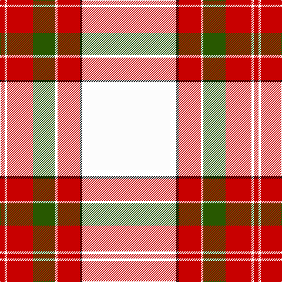

The parent of this is [Wilsons' Blanket Pattern (Artefact)](/tartans/r/8/w4/r44/g38/w4/r38/k4/w/160/)

This was sourced from tartans-authority.  It is a [8 stripes tartan](/stripes/stripes8/).

Original link http://www.tartansauthority.com/tartan-ferret/display/3704/

## Thread count
R/8 W4 R44 G38 W4 R38 K4 W/160

## Palette
Each colour and its ΔE from the base-6 reference it is a variant of.

| Colour | Shade | Base | ΔE (OKLab) |
|---|---|---|---|
| G |  `#285800` | G  | 0.04 |
| K |  `#101010` | K  | 0.17 |
| R |  `#C80000` | R  | 0.00 |
| W |  `#FCFCFC` | W  | 0.03 |

# Sample pattern

ID: /variants/r/8/w4/r44/g38/w4/r38/k4/w/160-g285800-k101010-rc80000-wfcfcfc/
