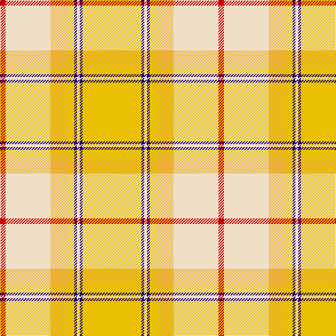

The parent of this is [Comrie Gold Fashion Tartan Tartan Number: 7606. Earliest known date: March 2008 One of a series of dancer's tartans for the House of Edgar's in-house collection designed by Kirsty Anderson. See products available Copyright © Blair Urquhart, Comrie, 2015](/tartans/r/8/w64/ya24/y10/db4/w4/db4/y/84/)

This was sourced from house-of-tartan.  It is a [8 stripes tartan](/stripes/stripes8/).

Original link http://www.house-of-tartan.scotland.net/house/TartanViewjs.asp?colr=Def&tnam=7606

## Thread count
R/8 W64 Ya24 Y10 DB4 W4 DB4 Y/84

## Palette
Each colour and its ΔE from the base-6 reference it is a variant of.

| Colour | Shade | Base | ΔE (OKLab) |
|---|---|---|---|
| DB |  `#1C0070` | B  | 0.14 |
| R |  `#C80000` | R  | 0.00 |
| W |  `#F0E0C8` | W  | 0.06 |
| Y |  `#E8C000` | Y  | 0.00 |
| Ya |  `#ECB034` | Y  | 0.05 |

# Sample pattern

ID: /variants/r/8/w64/ya24/y10/db4/w4/db4/y/84-db1c0070-rc80000-wf0e0c8-ye8c000-yaecb034/
