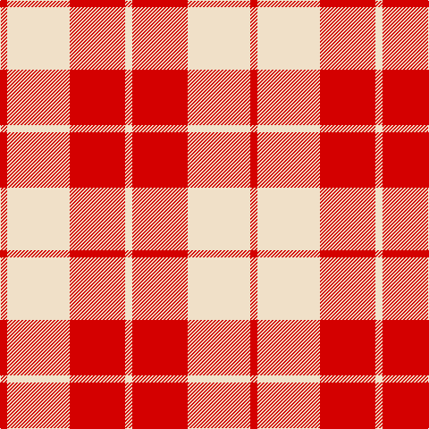

The parent of this is [Lewis Red Fashion Tartan Tartan Number: 7570. Earliest known date: March 2008 One of a series of dancer's tartans for the House of Edgar's in-house collection designed by Kirsty Anderson. See products available Copyright © Blair Urquhart, Comrie, 2015](/tartans/r/8/w70/r62/w/8/)

This was sourced from house-of-tartan.  It is a [4 stripes tartan](/stripes/stripes4/).

Original link http://www.house-of-tartan.scotland.net/house/TartanViewjs.asp?colr=Def&tnam=7570

## Thread count
R/8 W70 R62 W/8

## Palette
Each colour and its ΔE from the base-6 reference it is a variant of.

| Colour | Shade | Base | ΔE (OKLab) |
|---|---|---|---|
| R |  `#D40000` | R  | 0.03 |
| W |  `#F0E0C8` | W  | 0.06 |

# Sample pattern

ID: /variants/r/8/w70/r62/w/8-rd40000-wf0e0c8/
