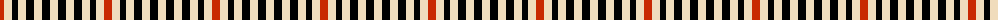

The parent of this is [Glen Feshie (Estate Check)](/tartans/r/8/w8/k6/w8/k8/w8/k8/w/8/)

This was sourced from tartans-authority.  It is a [8 stripes tartan](/stripes/stripes8/).

Original link http://www.tartansauthority.com/tartan-ferret/display/5008/

## Thread count
R/8 W8 K6 W8 K8 W8 K8 W/8

## Palette
Each colour and its ΔE from the base-6 reference it is a variant of.

| Colour | Shade | Base | ΔE (OKLab) |
|---|---|---|---|
| K |  `#000000` | K  | 0.00 |
| R |  `#C82800` | R  | 0.03 |
| W |  `#F0DCBC` | W  | 0.08 |

# Sample pattern

ID: /variants/r/8/w8/k6/w8/k8/w8/k8/w/8-k000000-rc82800-wf0dcbc/
