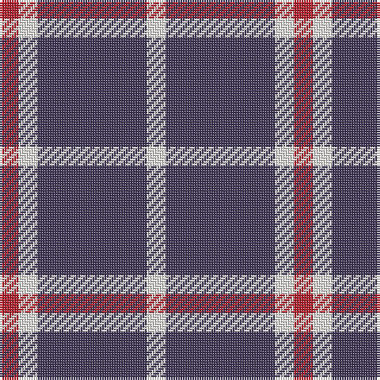

The parent of this is [Auchmaliddie Samkoma](/tartans/r/8/w8/n46/w/8/)

This was sourced from register-of-tartans.  It is a [4 stripes tartan](/stripes/stripes4/).

Original link https://www.tartanregister.gov.uk/tartanDetails.aspx?ref=10348

## Thread count
R/8 W8 N46 W/8

## Palette
Each colour and its ΔE from the base-6 reference it is a variant of.

| Colour | Shade | Base | ΔE (OKLab) |
|---|---|---|---|
| N |  `#433A5A` | B  | 0.08 |
| R |  `#B62531` | R  | 0.04 |
| W |  `#F9F5EF` | W  | 0.01 |

# Sample pattern

ID: /variants/r/8/w8/n46/w/8-n433a5a-rb62531-wf9f5ef/
