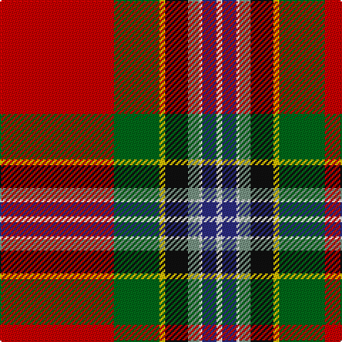

The parent of this is [Caledonian Soc., Ancient (Artefact)](/tartans/r/80/g32/y4/k16/lg8/w2/db10/w/4/)

This was sourced from tartans-authority.  It is a [8 stripes tartan](/stripes/stripes8/).

Original link http://www.tartansauthority.com/tartan-ferret/display/1554/

## Thread count
R/80 G32 Y4 K16 LG8 W2 DB10 W/4

## Palette
Each colour and its ΔE from the base-6 reference it is a variant of.

| Colour | Shade | Base | ΔE (OKLab) |
|---|---|---|---|
| DB |  `#2C2C80` | B  | 0.05 |
| G |  `#006818` | G  | 0.02 |
| K |  `#101010` | K  | 0.17 |
| LG |  `#789484` | G  | 0.23 |
| R |  `#C80000` | R  | 0.00 |
| W |  `#F8F8F8` | W  | 0.01 |
| Y |  `#E8C000` | Y  | 0.00 |

# Sample pattern

ID: /variants/r/80/g32/y4/k16/lg8/w2/db10/w/4-db2c2c80-g006818-k101010-lg789484-rc80000-wf8f8f8-ye8c000/
