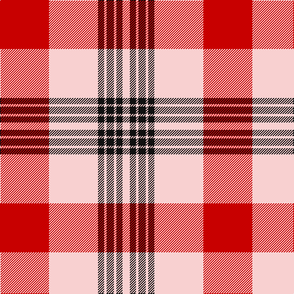

The parent of this is [Masai Shuka 14 (Artefact)](/tartans/r/80/w80/k10/w4/k12/w4/k10/w/12/)

This was sourced from tartans-authority.  It is a [8 stripes tartan](/stripes/stripes8/).

Original link http://www.tartansauthority.com/tartan-ferret/display/7204/

## Thread count
R/80 W80 K10 W4 K12 W4 K10 W/12

## Palette
Each colour and its ΔE from the base-6 reference it is a variant of.

| Colour | Shade | Base | ΔE (OKLab) |
|---|---|---|---|
| K |  `#101010` | K  | 0.17 |
| R |  `#C80000` | R  | 0.00 |
| W |  `#F8D0D0` | W  | 0.09 |

# Sample pattern

ID: /variants/r/80/w80/k10/w4/k12/w4/k10/w/12-k101010-rc80000-wf8d0d0/
