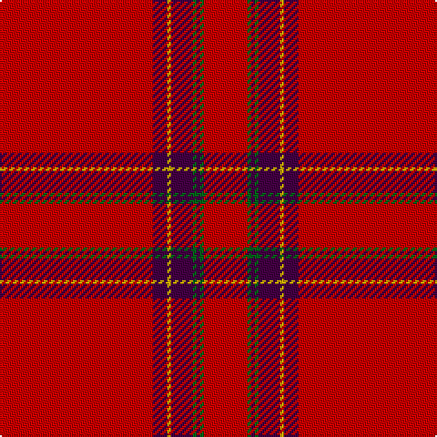

The parent of this is [Earl of Inverness (Artefact)](/tartans/r/84/dp8/y2/dp12/g2/dp2/g2/r/24/)

This was sourced from tartans-authority.  It is a [8 stripes tartan](/stripes/stripes8/).

Original link http://www.tartansauthority.com/tartan-ferret/display/1446/

## Thread count
R/84 DP8 Y2 DP12 G2 DP2 G2 R/24

## Palette
Each colour and its ΔE from the base-6 reference it is a variant of.

| Colour | Shade | Base | ΔE (OKLab) |
|---|---|---|---|
| DP |  `#440044` | B  | 0.17 |
| G |  `#006818` | G  | 0.02 |
| R |  `#C80000` | R  | 0.00 |
| Y |  `#D8B000` | Y  | 0.05 |

# Sample pattern

ID: /variants/r/84/dp8/y2/dp12/g2/dp2/g2/r/24-dp440044-g006818-rc80000-yd8b000/
