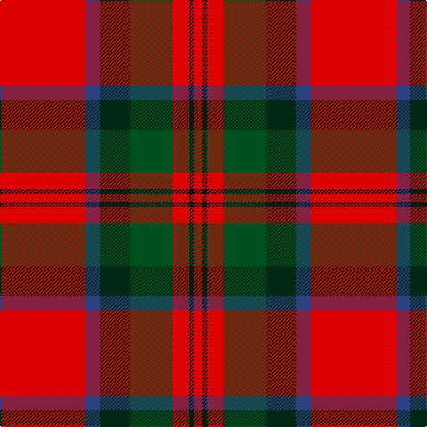

The parent of this is [MacDuff](/tartans/r/96/b16/dg34/g48/r18/k6/r/9/)

This was sourced from register-of-tartans.  It is a [7 stripes tartan](/stripes/stripes7/).

Original link https://www.tartanregister.gov.uk/tartanDetails.aspx?ref=2413

## Thread count
R/96 B16 DG34 G48 R18 K6 R/9

## Palette
Each colour and its ΔE from the base-6 reference it is a variant of.

| Colour | Shade | Base | ΔE (OKLab) |
|---|---|---|---|
| B |  `#2C4084` | B  | 0.00 |
| DG |  `#002814` | B  | 0.21 |
| G |  `#005020` | G  | 0.08 |
| K |  `#101010` | K  | 0.17 |
| R |  `#DC0000` | R  | 0.04 |

# Sample pattern

ID: /variants/r/96/b16/dg34/g48/r18/k6/r/9-b2c4084-dg002814-g005020-k101010-rdc0000/
