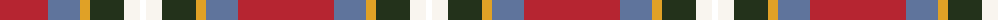

The parent of this is [Scottish American Society of Michigan (Official)](/tartans/r/96/b32/y10/k34/w16/t/6/)

This was sourced from register-of-tartans.  It is a [6 stripes tartan](/stripes/stripes6/).

Original link https://www.tartanregister.gov.uk/tartanDetails.aspx?ref=10507

## Thread count
R/96 B32 Y10 K34 W16 T/6

## Palette
Each colour and its ΔE from the base-6 reference it is a variant of.

| Colour | Shade | Base | ΔE (OKLab) |
|---|---|---|---|
| B |  `#5F749C` | B  | 0.17 |
| K |  `#23321B` | G  | 0.17 |
| R |  `#B62531` | R  | 0.04 |
| W |  `#F9F5EF` | W  | 0.01 |
| Y |  `#E0A126` | Y  | 0.08 |

# Sample pattern

ID: /variants/r/96/b32/y10/k34/w16/t/6-b5f749c-k23321b-rb62531-wf9f5ef-ye0a126/
