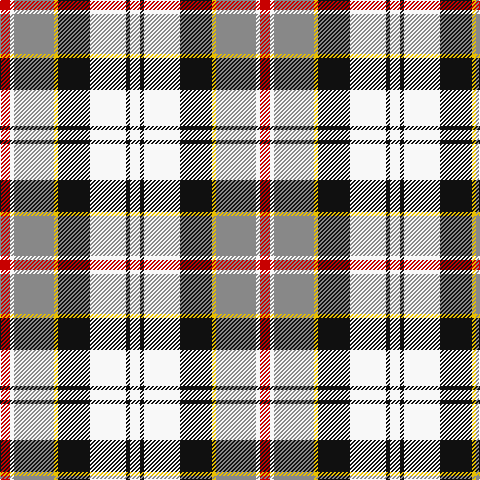

The parent of this is [Ailsa Craig](/tartans/ra/10/w4/na40/y4/k32/w36/k4/w/10/)

This was sourced from register-of-tartans.  It is a [8 stripes tartan](/stripes/stripes8/).

Original link https://www.tartanregister.gov.uk/tartanDetails.aspx?ref=27

## Thread count
Ra/10 W4 Na40 Y4 K32 W36 K4 W/10

## Palette
Each colour and its ΔE from the base-6 reference it is a variant of.

| Colour | Shade | Base | ΔE (OKLab) |
|---|---|---|---|
| K |  `#101010` | K  | 0.17 |
| LN |  `#E0E0E0` | W  | 0.06 |
| N |  `#5C5C5C` | B  | 0.14 |
| Na |  `#888888` | R  | 0.24 |
| R |  `#C80000` | R  | 0.00 |
| Ra |  `#C80000` | R  | 0.00 |
| W |  `#F8F8F8` | W  | 0.01 |
| Y |  `#E8C000` | Y  | 0.00 |

# Sample pattern

ID: /variants/ra/10/w4/na40/y4/k32/w36/k4/w/10-k101010-lne0e0e0-n5c5c5c-na888888-rc80000-rac80000-wf8f8f8-ye8c000/
