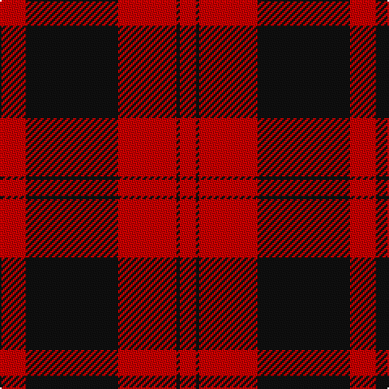

The parent of this is [Rosser (Welsh Name)](/tartans/ra/16/k57/r36/k2/r4/ra/2/)

This was sourced from tartans-authority.  It is a [6 stripes tartan](/stripes/stripes6/).

Original link http://www.tartansauthority.com/tartan-ferret/display/4128/

## Thread count
Ra/16 K57 R36 K2 R4 Ra/2

## Palette
Each colour and its ΔE from the base-6 reference it is a variant of.

| Colour | Shade | Base | ΔE (OKLab) |
|---|---|---|---|
| K |  `#101010` | K  | 0.17 |
| R |  `#C80000` | R  | 0.00 |
| Ra |  `#C80000` | R  | 0.00 |

# Sample pattern

ID: /variants/ra/16/k57/r36/k2/r4/ra/2-k101010-rc80000-rac80000/
