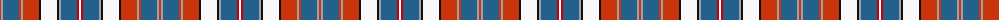

The parent of this is [Robieson (Personal)](/tartans/ra/2/n2/b16/ra2/n2/ra16/k2/w16/k2/n2/b16/r2/w/2/)

This was sourced from tartans-authority.  It is a [13 stripes tartan](/stripes/stripes13/).

Original link http://www.tartansauthority.com/tartan-ferret/display/6723/

## Thread count
Ra/2 N2 B16 Ra2 N2 Ra16 K2 W16 K2 N2 B16 R2 W/2

## Palette
Each colour and its ΔE from the base-6 reference it is a variant of.

| Colour | Shade | Base | ΔE (OKLab) |
|---|---|---|---|
| B |  `#24608C` | B  | 0.09 |
| K |  `#101010` | K  | 0.17 |
| N |  `#A0A0A0` | Y  | 0.20 |
| R |  `#C80000` | R  | 0.00 |
| Ra |  `#C8340C` | R  | 0.04 |
| W |  `#F8F8F8` | W  | 0.01 |

ID: /variants/ra/2/n2/b16/ra2/n2/ra16/k2/w16/k2/n2/b16/r2/w/2-b24608c-k101010-na0a0a0-rc80000-rac8340c-wf8f8f8/
