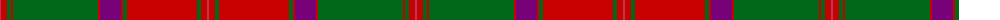

The parent of this is [Crieff (District)](/tartans/ra/2/r6/g4/r2/g85/r2/p21/r2/g4/r70/g4/r6/ra/2/)

This was sourced from tartans-authority.  It is a [13 stripes tartan](/stripes/stripes13/).

Original link http://www.tartansauthority.com/tartan-ferret/display/1636/

## Thread count
Ra/2 R6 G4 R2 G85 R2 P21 R2 G4 R70 G4 R6 Ra/2

## Palette
Each colour and its ΔE from the base-6 reference it is a variant of.

| Colour | Shade | Base | ΔE (OKLab) |
|---|---|---|---|
| G |  `#006818` | G  | 0.02 |
| P |  `#780078` | B  | 0.16 |
| R |  `#C80000` | R  | 0.00 |
| Ra |  `#B43C50` | R  | 0.08 |

ID: /variants/ra/2/r6/g4/r2/g85/r2/p21/r2/g4/r70/g4/r6/ra/2-g006818-p780078-rc80000-rab43c50/
