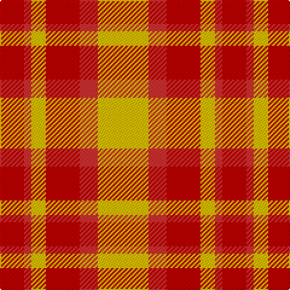

The parent of this is [Kozlosky, Kilt](/tartans/ra/20/r6/y12/ra28/r15/y/42/)

This was sourced from weddslist.  It is a [6 stripes tartan](/stripes/stripes6/).

Original link http://www.weddslist.com/cgi-bin/tartans/pg.pl?source=sts

## Thread count
Ra/20 R6 Y12 Ra28 R15 Y/42

## Palette
Each colour and its ΔE from the base-6 reference it is a variant of.

| Colour | Shade | Base | ΔE (OKLab) |
|---|---|---|---|
| R |  `#D03030` | R  | 0.05 |
| Ra |  `#C00000` | R  | 0.02 |
| Y |  `#F0C000` | Y  | 0.01 |

# Sample pattern

ID: /variants/ra/20/r6/y12/ra28/r15/y/42-rd03030-rac00000-yf0c000/
